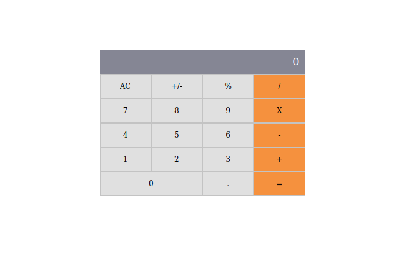

# math-magicians-app
* This is a Project that works retrieving and sending data with two Foreign APIS in order to render and interact with items in the screen using React.



## Built With

- Html, Javascript, SCSS
- Webpack
- React JS
- Developed in VSCode

## Setup 
### clone repository
```bash
$ git clone <git@github.com:elassis/react-app-magic-mathematicians.git>
```
### Start Project
```bash
$ cd Math_magicians -Install node_modules, run npm install
$ npm run start
```

### Author 🤝:
* Juan Luis Gonzalez 
- Github: [@githubhandle](https://github.com/JbirdL86)
- Twitter: [@twitterhandle](https://twitter.com/JuanLui06498455)
- Linkedin: [linkedin](https://www.linkedin.com/in/juan-luis-0551921aa/)

## 🤝 Contributing

Contributions, issues, and feature requests are welcome!

Feel free to check the issues page. [issues page](https://github.com/JbirdL86/math-magicians/issues).

## Show your support

Give a ⭐️ if you like this project!

## 📝 License

This project is [MIT](./MIT.md) licensed.